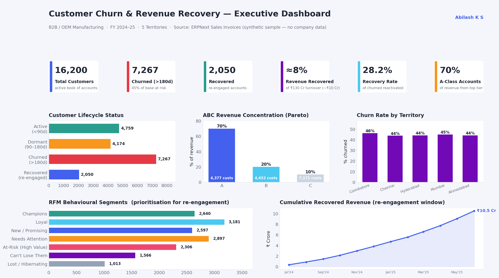

# Customer Churn Analysis & Revenue Recovery

> A behavioural-segmentation framework that identified dormant and churned B2B accounts across 5 territories and drove **revenue equivalent to ≈8% of a ₹130 Cr annual turnover** back into the business through prioritised re-engagement.




> ⚠️ **Data note:** This is a **case study of a real engagement**, reconstructed on **synthetic data** that mirrors the ERPNext Sales Invoice structure (customer, invoice date, amount, territory). No confidential company data is published. The headline outcomes quoted are from the real project; all figures shown in the dashboard are illustrative and generated by [`scripts/churn_analysis.py`](scripts/churn_analysis.py).

---

## 📖 Overview

A B2B / OEM manufacturing business with a book of **16,000+ customers** across 5 regional territories was seeing a steady revenue decline through 2024 — not from losing marquee clients loudly, but from a quiet drift of mid-tier accounts going dormant and never returning. There was no systematic way to answer three questions:

1. **Who has actually stopped buying** (vs. who's just between orders)?
2. **Which of those accounts are worth chasing** (not all churn is equal)?
3. **Where should a 20+ person sales team spend re-engagement effort first?**

This project built a repeatable framework — data pulled from **ERPNext**, segmented with **ABC + RFM**, and surfaced in dashboards — to answer all three and turn the churn curve around.

---

## 🎯 Business Problem

- 📉 **Revenue drop** through mid-2024, driven by silent attrition rather than obvious account losses.
- 🔍 **No churn definition** — sales had no agreed rule for when a customer counts as "lost."
- 🎲 **Untargeted follow-up** — the team chased whoever they remembered, not the highest-value at-risk accounts.
- 🗺️ **No territory visibility** — leadership couldn't see which of the 5 regions was bleeding the most.

---

## 🗃️ Data

| Attribute | Detail |
|---|---|
| **Source system** | ERPNext — *Sales Invoice* doctype |
| **Grain** | One row per invoice |
| **Key fields** | `customer`, `invoice_date`, `amount`, `territory` |
| **Scope** | ~16,200 customers · 5 territories · ~2 years of history |
| **Extraction** | ERPNext Insights (native query/report builder) |
| **Modelling** | Excel (ABC/RFM scoring) → Looker Studio (dashboard) |

A synthetic, invoice-level sample mirroring this structure lives in [`data/sample_sales_invoices.csv`](data/sample_sales_invoices.csv).

---

## 🧪 Methodology

### 1. Lifecycle status — a shared definition of churn
Using days since last invoice as of the analysis date:

| Status | Rule | Meaning |
|---|---|---|
| 🟢 **Active** | < 90 days | Buying normally |
| 🟠 **Dormant** | 90–180 days | Early warning — intervene now |
| 🔴 **Churned** | > 180 days | Lapsed — needs recovery |

The **90-day dormant flag** is the key lever: it catches accounts *before* they cross into churn, when re-engagement is cheapest.

### 2. ABC segmentation — focus on what pays
Customers ranked by revenue contribution and split Pareto-style:
- **A** = top ~70% of revenue → protect at all costs
- **B** = next ~20% → nurture
- **C** = final ~10% → automate / low-touch

### 3. RFM scoring — prioritise *who* to chase first
Each account scored 1–5 on **Recency, Frequency, Monetary**, then labelled into behavioural segments so the sales team gets a ranked call list, not a spreadsheet dump:

`Champions` · `Loyal` · `At-Risk (High Value)` · `Can't Lose Them` · `Needs Attention` · `Lost / Hibernating`

The intersection that mattered most: **A-class + At-Risk / Can't-Lose-Them** — high-value accounts with slipping recency. That's where re-engagement effort was concentrated.

---

## 💡 Key Insights

- **~44% of the customer base (7,000+ accounts) had crossed the 180-day churn line** — the decline was broad-based dormancy, not a few lost whales.
- **Revenue was highly concentrated** — the A-class tier drove ~70% of turnover, so protecting a relatively small set of accounts mattered disproportionately.
- **Churn was uneven across territories** — some regions carried materially higher lapse rates, redirecting where field effort was deployed.
- **A large share of churned revenue sat in recoverable, high-RFM accounts** — customers who *had* bought consistently and simply drifted, i.e. winnable back.

---

## 📈 Results

| Outcome | Value |
|---|---|
| Accounts re-engaged | **2,000+** |
| Recovery rate (of churned) | **~28%** |
| Revenue recovered | **≈8% of ₹130 Cr turnover (~₹10 Cr)** |
| Reporting standardised | Single churn definition adopted across 5 territories |

The framework moved the sales motion from reactive ("who do we remember?") to prioritised ("here are the 300 highest-value at-risk accounts, by territory, this week").

---

## 🔁 Reproduce the Analysis

```bash
pip install pandas numpy matplotlib
python scripts/churn_analysis.py
```

This regenerates the synthetic dataset, runs the full ABC + RFM + status classification, and renders `assets/dashboard_overview.png`.

---

## 🧰 Skills & Tools Used

**BI & Visualisation**
`Looker Studio` · `ERPNext Insights` · `KPI Dashboard Design` · `Executive reporting` · `matplotlib` (analysis dashboard)

**Data & Programming**
`Python` · `pandas` · `NumPy` · `Excel (ABC / RFM modelling)` · `Data cleaning & transformation`

**Analytics & Segmentation**
`Customer Churn Analysis` · `RFM Segmentation` · `ABC Analysis` · `Purchase-gap / recency analysis` · `Revenue recovery analysis` · `Customer lifecycle status modelling`

**Business Analysis**
`Territory-wise analysis (5 regions)` · `Re-engagement strategy` · `KPI definition` · `Stakeholder reporting` · `Data-driven decision support`

---

## 🗂️ Folder Structure

```
customer-churn-revenue-recovery/
├── README.md
├── assets/
│   └── dashboard_overview.png      # executive dashboard (rendered from synthetic data)
├── data/
│   └── sample_sales_invoices.csv   # synthetic invoice-level sample
├── scripts/
│   └── churn_analysis.py           # data gen + ABC/RFM + dashboard render
└── LICENSE
```

---

## 🏢 Business Impact

- **Recovered revenue** worth roughly 8% of annual turnover from accounts that were effectively written off.
- **Gave leadership a repeatable early-warning system** — the 90-day dormant flag turns churn from a post-mortem into a prevention workflow.
- **Focused a 20+ person sales team** on ranked, value-weighted call lists instead of gut feel.
- **Created a shared vocabulary** (Active / Dormant / Churned, A/B/C, RFM segments) that survives beyond any single dashboard.

---

## 🚀 Future Improvements

- **Predictive churn scoring** — replace the rule-based 180-day cutoff with a survival/propensity model (scikit-learn) to flag risk *before* the gap appears.
- **Automated ERPNext alerts** — trigger a task/notification when an A-class account crosses the 90-day dormant threshold.
- **Recovery attribution** — track re-engagement touch → order to measure campaign ROI per territory.
- **Self-serve refresh** — schedule the pull so the dashboard updates without manual export.

---

<p align="center">
  <strong>Abilash K S</strong> · Business & Data Analyst<br>
  <a href="https://portfolio-abilash-ks.vercel.app/">Portfolio</a> ·
  <a href="https://www.linkedin.com/in/abilash-k-s/">LinkedIn</a> ·
  <a href="mailto:abilash.connect@zohomail.in">Email</a>
</p>
